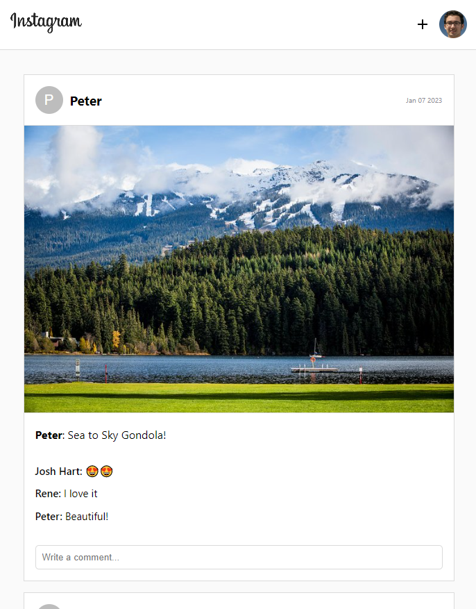
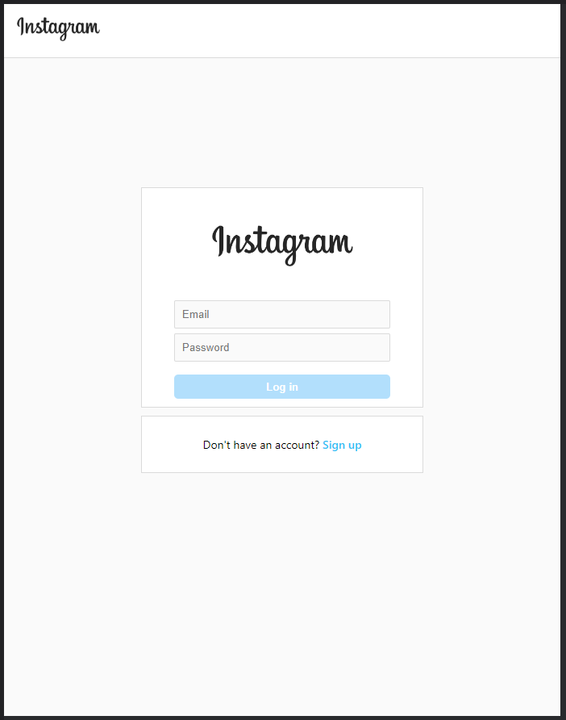
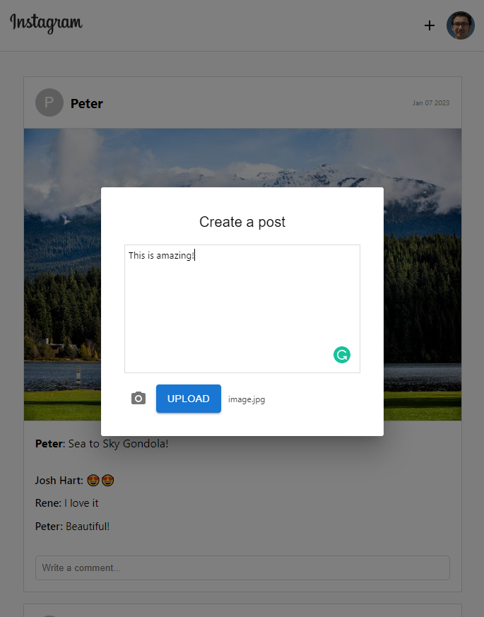

# 📗 Table of Contents

- [📗 Table of Contents](#-table-of-contents)
- [📖 Instagram\_clone ](#-instagram_clone-)
  - [Screenshots:](#screenshots)
  - [🛠 Built With ](#-built-with-)
    - [Tech Stack ](#tech-stack-)
    - [Key Features ](#key-features-)
  - [🚀 Live Demo ](#-live-demo-)
  - [💻 Getting Started ](#-getting-started-)
    - [Run :](#run-)
    - [Prerequisites](#prerequisites)
    - [Install](#install)
    - [Usage](#usage)
  - [👥 Authors ](#-authors-)
    - [👤 **Jake Felice**](#-jake-felice)
  - [🤝 Contributing ](#-contributing-)
  - [⭐️ Show your support ](#️-show-your-support-)
  - [🙏 Acknowledgments ](#-acknowledgments-)
  - [📝 License ](#-license-)

<!-- PROJECT DESCRIPTION -->

# 📖 Instagram_clone 

> This is a clone of Instagram. After creating an account, users can create or browse all the posts and comment on them.

## 
Screenshots:

  

    
  

   

    
  

   

    
  

## 🛠 Built With 

### Tech Stack 

> HTML, CSS, JavaScript, React, MUI and Firebase

  
Client

  <ul>
    <li><a href="https://reactjs.org/">React.js</a></li>
  </ul>

  
Server

  <ul>
    <li><a href="https://firebase.google.com/">Firebase</a></li>
  </ul>

Database

  <ul>
    <li><a href="https://firebase.google.com/">Firebase</a></li>
  </ul>

<!-- Features -->

### Key Features 

- **Create Post**
- **Post Comment**

(<a href="#readme-top">back to top</a>)

<!-- LIVE DEMO -->

## 🚀 Live Demo 

- [Live Demo Link](https://yourdeployedapplicationlink.com)

(<a href="#readme-top">back to top</a>)

<!-- GETTING STARTED -->

## 💻 Getting Started 

>To get a local copy up and running, follow these steps.

### Run :
- `git clone https://github.com/jasonfelice/ig-clone.git`
- `cd ig-clone`

### Prerequisites

> In order to run this project you need:

- Git
- Node.js
- Yarn or NPM

### Install

> Install this project with:
- `npm install`

### Usage

> To run the project, execute the following command:
- `npm start`

(<a href="#readme-top">back to top</a>)

<!-- AUTHORS -->

## 👥 Authors 

### 👤 **Jake Felice**

- GitHub: [@jasonfelice](https://github.com/jasonfelice)
- Twitter: [@jasonfelice0](https://twitter.com/jasonfelice0)
- LinkedIn: [LinkedIn](https://www.linkedin.com/in/jason-felice-11a5a622b/)

(<a href="#readme-top">back to top</a>)

<!-- CONTRIBUTING -->

## 🤝 Contributing 

Contributions, issues, and feature requests are welcome!

Feel free to check the [issues page](../../issues/).

(<a href="#readme-top">back to top</a>)

<!-- SUPPORT -->

## ⭐️ Show your support 

If you like this project, dont' forget to star it and follow me on GitHub.

(<a href="#readme-top">back to top</a>)

<!-- ACKNOWLEDGEMENTS -->

## 🙏 Acknowledgments 

I would like to thank [Clever Programming](https://www.youtube.com/@CleverProgrammer) for inspiring me to build this project.

(<a href="#readme-top">back to top</a>)

<!-- LICENSE -->

## 📝 License 

This project is [MIT](./LICENSE.md) licensed.

(<a href="#readme-top">back to top</a>)
